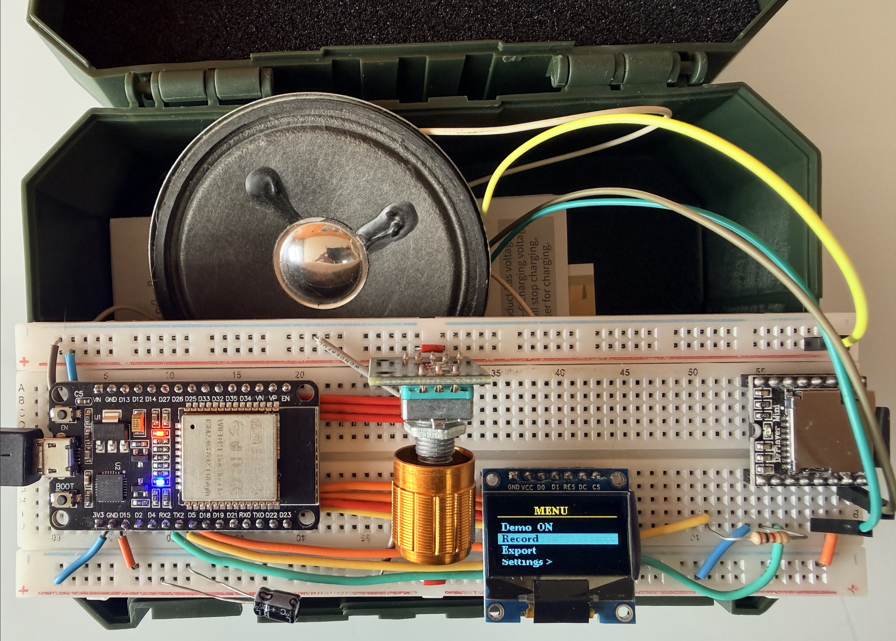

# Arduino OBD2 Turbo Sound Emulator

An ESP32 device that reads live OBD2 data from your car and plays a turbo
blow-off valve "pssssh" sound through a speaker whenever you lift off
the throttle during a gear change — emulating the iconic Fast & Furious
turbo sound.

The device also shows live gauges (throttle, RPM, speed, gear) on a
small OLED screen.

<p align="center">
  
  <br>
  <em>The complete project assembled on a breadboard — ESP32, SSD1306 OLED, DFPlayer Mini, KY-040 rotary encoder, and speaker wired up and ready to plug into a car's OBD2 port.</em>
</p>

---

## Quick start

Python 3.x is required for the test suite, visual monitor, and recording viewer.

```bash
# 1. Install Python dependencies (creates .venv, installs pytest and friends)
make build

# 2. Verify everything works
make test

# 3. Start the recording viewer (no extra deps needed — uses Python stdlib)
make viewer          # then open http://localhost:8080
make stop-viewer     # stop it when done
```

For firmware: see [Emulators/](Emulators/README.md) (no hardware) or
[sketches/](sketches/README.md) (real ESP32).

---

## How it works

A turbo blow-off valve vents pressurised intake air when the driver lifts
off the throttle while the turbo is still spinning. This creates the
distinctive "pssssh" sound. This device detects that moment from OBD2 data:

1. Connects to the car's OBD2 port via a Bluetooth ELM327 dongle
2. Polls OBD2 data at a rate that adapts to engine state:
   - **Parked** (RPM < 200) — reads battery voltage, coolant temp, RPM every 3 s
   - **Idle** (RPM 200–999) — reads RPM only every 500 ms; rotary encoder fully responsive
   - **Driving** (RPM ≥ 1000) — reads throttle, speed, RPM every 100 ms
3. When the rotary encoder is turned, OBD2 polling pauses for 500 ms so the screen updates instantly
4. In driving mode, when throttle drops rapidly from high to low while RPM is in the
   boost range (and in 1st or 2nd gear), it triggers a pre-recorded Turbo sound
5. Displays live gauges on a 0.96" OLED screen — 4 views navigated with the rotary encoder

**Target car:** Mercedes CLA180 (2011, gasoline)

---

## Hardware

| Component             | Notes                                                   |
| --------------------- | ------------------------------------------------------- |
| ELEGOO ESP-WROOM-32   | Main microcontroller — Bluetooth Classic + BLE          |
| OBD BLE dongle        | BLE (not Classic BT) — plugs into car OBD2 port         |
| 0.96" SSD1306 OLED    | 128×64 SPI display (pins: GND,VCC,D0,D1,RES,DC,CS)      |
| DFPlayer Mini         | MP3 playback module — 3.3V power, 1kΩ on RX line        |
| KY-040 rotary encoder | Navigation: rotate = cycle views, click = disconnect    |
| microSD card (FAT32)  | Stores audio files in `/mp3/` — see [mp3/](mp3/README.md) |
| Small speaker (4–8 Ω) | Plays the Turbo sound                                   |

---

## Turbo trigger logic

```
throttle was > 40%  AND  throttle now < 10%
AND  RPM > 1500  AND  gear <= 2
→ play /mp3/0010.mp3 or 0011.mp3
```

All thresholds are tunable via the **Settings** menu on the device — changes
survive power cycles (stored in NVS flash).

---

## Folder guide

| Folder | Contents |
| ------ | -------- |
| [Emulators/](Emulators/README.md) | Wokwi circuit simulation — run the firmware without hardware |
| [lib/](lib/README.md) | Shared Python logic (trigger detection) used by tests and viewer |
| [mp3/](mp3/README.md) | Audio files for the SD card — file list, format requirements, speaker wiring |
| [recordings/](recordings/README.md) | OBD2 CSV recordings — how to record, export via WiFi, CSV format |
| [sketches/](sketches/README.md) | Arduino sketch — structure, build modes, flashing instructions |
| [tests/](tests/README.md) | Test suite — unit tests, visual monitor, integration tests |
| [viewer/](viewer/README.md) | Web viewer for inspecting recordings as interactive charts |

---

## Recording and viewing drives

<p align="center">
  
  <br>
  <em>The recording viewer running in a browser — TPS, RPM, and speed plotted on a single interactive chart with yellow markers showing each Turbo trigger event. Use it to verify trigger timing, tune thresholds, and replay real drives without being in the car.</em>
</p>

The device records live OBD2 data to flash while you drive, then exports via WiFi.
See [recordings/README.md](recordings/README.md) for full instructions.

To inspect a recording:

```bash
make viewer   # open http://localhost:8080
```

See [viewer/README.md](viewer/README.md) for details.

---

## Simulation

<p align="center">
  
  <br>
  <em>The Wokwi circuit simulation running inside VS Code — the virtual OLED displays live gauges, the encoder can be turned to cycle views, and the buzzer fires whenever the built-in driving scenario triggers a Turbo event. No hardware required.</em>
</p>

A full circuit simulation lives in [`Emulators/Wokwi/`](Emulators/Wokwi/) — no hardware needed.
See [Emulators/README.md](Emulators/README.md) for setup instructions.

```bash
make wokwi-setup   # one time
make wokwi-build   # compile firmware, then open Emulators/Wokwi/diagram.json in VS Code
```

---

## Project plan

Full technical details, wiring table, state machine, all references, and
the complete code skeleton are in
[esp32_obd2_dashboard_plan.md](esp32_obd2_dashboard_plan.md).

---

## Related projects

- [arduino-laser-target](https://github.com/marcelovani/arduino-laser-target)
  — uses the same SSD1306 OLED + KY-040 encoder + DFPlayer Mini pattern
