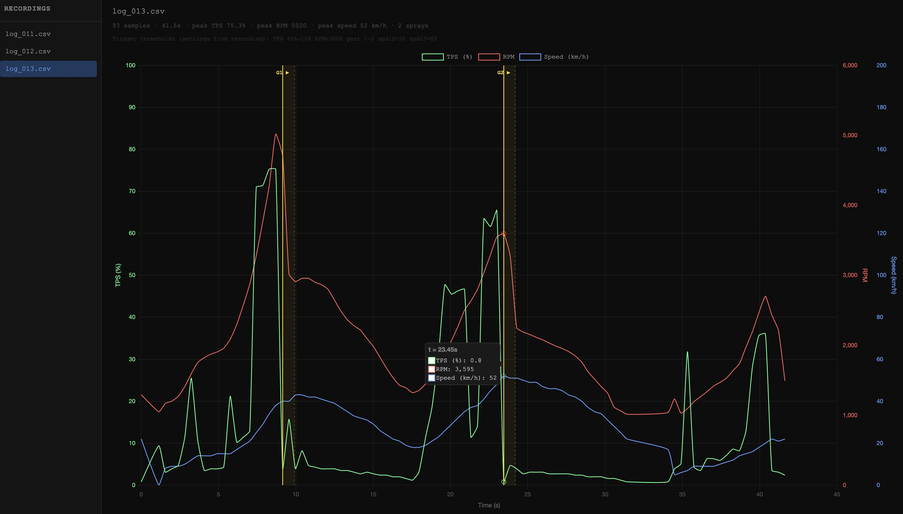

# viewer

A lightweight web app for inspecting OBD2 recordings as interactive charts.
No external dependencies — the server uses only Python's standard library and
loads [Chart.js](https://www.chartjs.org/) from a CDN.

## Usage

```bash
make viewer        # start in background → open http://localhost:8080
make stop-viewer   # stop the server
```

## What it shows

<p align="center">
  
  <br>
  <em>TPS, RPM, and speed plotted on a single interactive chart with yellow markers
  showing each Turbo trigger event.</em>
</p>

- **Sidebar** — lists every `.csv` file in the `recordings/` folder; click one to load it
- **Chart** — TPS (green), RPM (red), Speed (blue/mph) over time in seconds, each on its own Y-axis
- **Hover** — crosshair tooltip shows all three values at that moment in time
- **Yellow markers** — each Turbo trigger is annotated with a solid line at start, a dashed line at end, and a faint band between — labelled with the gear (`G1 ▶`, `G2 ▶`)
- **Drag to zoom** — drag on the chart to zoom into any time range; pan by scrolling; click **Reset Zoom** to go back
- **Stats bar** — sample count, total duration, peak TPS/RPM/speed for the file
- **Settings bar** — shows the trigger thresholds that were active when the recording was made (read from the CSV header, or Config.h defaults for older files)

## Files

| File        | Role                                                   |
| ----------- | ------------------------------------------------------ |
| `server.py` | Python HTTP server — serves static files and `/api/*` endpoints |
| `index.html`| Page layout — sidebar, chart canvas, stats bar         |
| `style.css` | Dark theme styles                                      |
| `app.js`    | Chart rendering, annotations, zoom, file loading       |

## API endpoints

| Endpoint            | Returns                                              |
| ------------------- | ---------------------------------------------------- |
| `GET /api/files`    | JSON array of `.csv` filenames in `recordings/`      |
| `GET /api/data/:f`  | JSON with `time`, `tps`, `rpm`, `speed`, `triggers`, `settings` arrays |

Trigger detection is performed server-side by replaying the CSV through
[`lib/turbo_logic.py`](../lib/README.md) — the same logic used by the test suite.

## After replacing a spray MP3

If you replace `mp3/0010.mp3` or `mp3/0011.mp3` with a new file, measure its
duration and update `SPRAY_DURATION_S` in `server.py` so the yellow annotation
bands stay accurate:

```bash
ffprobe -v error -show_entries format=duration \
  -of default=noprint_wrappers=1:nokey=1 mp3/0010.mp3
```
